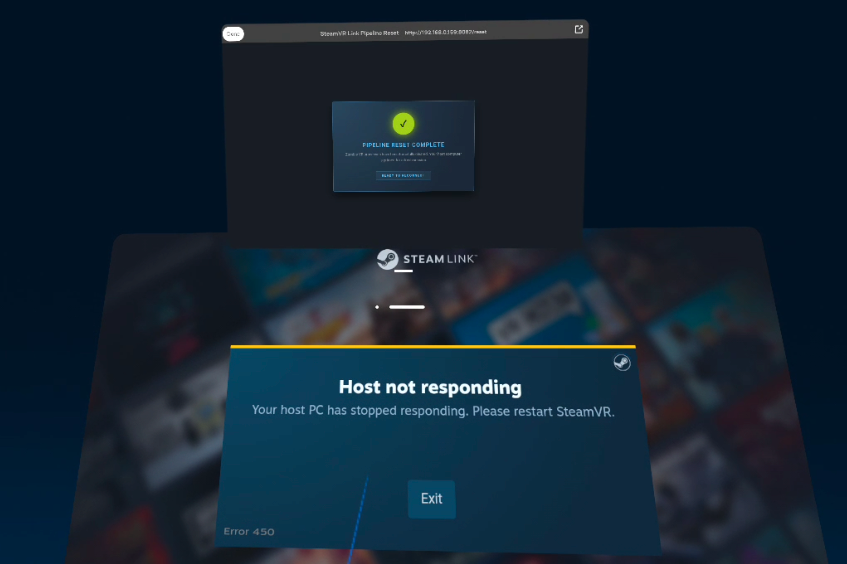

# Steam Link VR Boundary Recovery Utility for Linux
This is just an itty-bitty band-aid born of the frustration of Steam Link disconnecting, and failing to reconnect if you step outside of your boundary for literally 5 seconds. On the Quest, it is possible (via developer settings) to remove the boundary entirely, but there are still situations where you accidentally disconnect. **In short**, this adds a shortcut within your quest directory that will remotely restart SteamVR. When it drops, you can click it, wait a few seconds, and open Steam Link to reconnect ***without walking back to your pc***.

<sub>*It is, ahem... mostly vibecoded, because I just wanted to play my danged vidyas.* 🤷‍♂️💻</sub>

---
If you trip your Quest 3 guardian boundary or trigger passthrough while playing PCVR on Linux, Steam Link will abruptly drop the connection, leaving you staring at this error screen inside your headset:



### 🔍 Anatomy of the Freeze & Fix

* 🔴 **The Foreground Problem:** The large **"Host not responding"** error box (Error 450) is blocking your view. Normally, this zombie state forces you to take off the headset and physically walk to your PC to restart SteamVR.
* 🟢 **The Background Solution:** Tapping a pinned bookmark hits `http://<YOUR_PC_IP>:8082/reset`, flushes the zombie processes in the background, and displays **"PIPELINE RESET COMPLETE."**

Once it flashes green, you just tap **Exit**, reopen Steam Link, and reconnect. You're back in your game in 5 seconds without ever leaving your play space.

---
⚠️ **Systemd Heads-Up:** Running the installer hooks a lightweight, user-level background daemon (`systemd --user`) on your machine that listens locally on port `8082`. It requires **zero root/sudo permissions**, but if you don't want a persistent background task running, skip the installer and just bind a keyboard hotkey directly to `bin/reset-vr`.

## Installation

1. Clone the repository to your local Linux machine:
```bash
git clone [https://github.com/yourusername/steamlink-linux-recovery.git](https://www.google.com/search?q=https://github.com/yourusername/steamlink-linux-recovery.git)
cd steamlink-linux-recovery
```
2. Execute the included script installation binary:
```bash
chmod +x install.sh
./install.sh
```
3. Verify that the background user execution daemon is active and green:
```bash
systemctl --user status vr-trigger.service
```

## Wireless Quest 3 Setup

1. Put on your Meta Quest headset and open the **Meta Horizon Browser**.
2. Look at the final output block printed by the `install.sh` script on your PC. Navigate directly to that automatically generated address:
```
http://<YOUR_DETECTED_IP>:8082/reset
```
3. Once the stylized verification screen displays, open the browser options and select **Add page to library**.
4. Drag and drop the newly created app icon directly onto your universal bottom navigation dock for instant access.


## Technical References & Bug Tracking

This utility directly addresses and bridges several upstream runtime limitations tracked inside the official `ValveSoftware/SteamVR-for-Linux` repository:

* **[BUG] SteamVR does not close VRserver on exit (#876):** Documents the exact behavior where the host background processes fail to release memory hooks and network sockets on termination, locking the subsystem until manually killed via process monitors.
* **[BUG] Steam Link VR Connection & Pipeline Hangs (#858 / #912):** Tracks the critical driver-level state freezes that occur under Wayland + NVIDIA architectures when a streaming client pauses its video pipeline (such as transitioning to passthrough/exiting the guardian boundary).
* **Upstream Driver Scope:** Bypasses unhandled `driver_vrlink.so` Vulkan crashes by providing an out-of-band execution loop to reset the local daemon runtime without requiring an entire display manager or hardware reboot.


## Uninstallation / Cleanup

If you want to completely purge this utility from your machine, just run this block in your terminal:

```bash
# Stop and disable the background web daemon
systemctl --user disable --now vr-trigger.service

# Delete the systemd user profile
rm -f "$HOME/.config/systemd/user/vr-trigger.service"

# Reload systemd to finalize the removal
systemctl --user daemon-reload

# Wipe the local binaries
rm -f "$HOME/.local/bin/reset-vr" "$HOME/.local/bin/vr-web-trigger.py"
```

## Credits & Attribution

* **Concept & Architecture:** Engineered in collaboration with **Gemini**, an AI companion by Google.
* **Active Bug Tracking Reference:** Solves community-reported edge behaviors relating to Valve's upstream SteamVR-for-Linux distribution engine.


